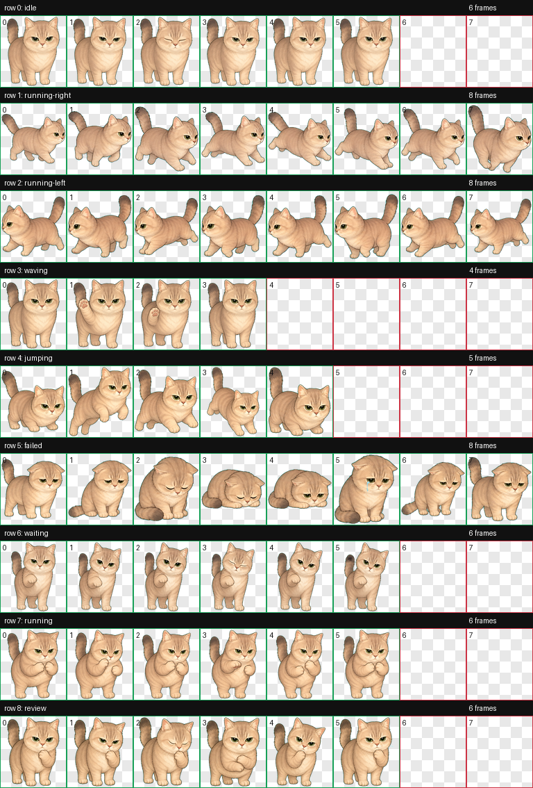
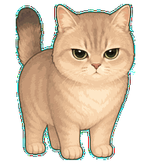
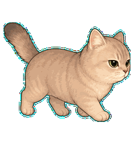
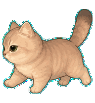
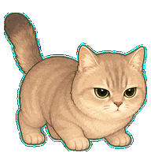

# Blanket Cat

A custom animated desktop pet for Codex, inspired by a calm silver-golden shaded cat with narrowed eyes and a soft sticker mascot style.



## What Is Included

- `pets/blanket-cat/pet.json`
- `pets/blanket-cat/spritesheet.webp`
- Preview GIFs for all Codex pet states in `previews/`

The pet includes the full Codex pet state set:

- `idle`
- `running-right`
- `running-left`
- `waving`
- `jumping`
- `failed`
- `waiting`
- `running`
- `review`

## Install

### macOS / Linux

Copy the pet folder into your Codex pets directory:

```bash
mkdir -p ~/.codex/pets
cp -R pets/blanket-cat ~/.codex/pets/
```

Then restart Codex and select `Blanket Cat` from the pet/avatar settings.

### Windows

Copy this folder:

```text
pets\blanket-cat
```

to:

```text
C:\Users\<your-user-name>\.codex\pets\blanket-cat
```

Then restart Codex and select `Blanket Cat` from the pet/avatar settings.

## Preview

| State | Preview |
| --- | --- |
| idle |  |
| running-right |  |
| running-left |  |
| waving |  |
| jumping |  |
| failed |  |
| waiting |  |
| running |  |
| review |  |

## Pet Metadata

```json
{
  "id": "blanket-cat",
  "displayName": "Blanket Cat",
  "spritesheetPath": "spritesheet.webp"
}
```

## License

This project is released under the MIT License. See [LICENSE](LICENSE).
